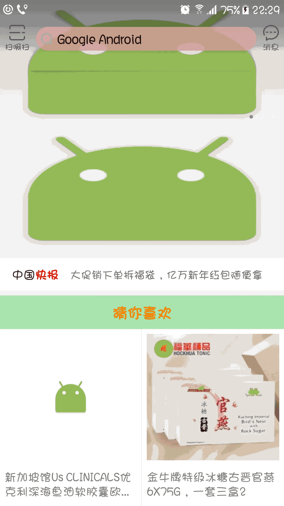

# RefreshTest

## 商城中使用的下拉刷新，上拉加载构件

### 有图有真相


### Demo下载


[二维码下载](/img/demo_down_pic.png)

### xml布局引入
```
 <com.shen.refresh.RefreshLoadLayout
       android:id="@+id/home_refresh_load_layout"
       android:layout_width="match_parent"
       android:layout_height="match_parent"
       android:background="@color/main_grey"
       refresh:refresh_enable="true"
       refresh:load_more_enable="true">
   </com.shen.refresh.RefreshLoadLayout>

```
refresh:refresh_enable="true" 表示可以进行下拉刷新

refresh:load_more_enable="true" 表示可以进行上拉加载更多

### 自定义下拉动画
#### 刷新布局加入：
```
	/**
     * 自定义刷新顶部布局，初始化显示控件
     */
    private void initRefreshLayout() {
        View refreshHeaderLayout = View.inflate(getContext(), R.layout.refresh_head_layout, null);

        keyTextTv = (TextView) refreshHeaderLayout.findViewById(R.id.refresh_key_text);
        refreshStateTv = (TextView) refreshHeaderLayout.findViewById(R.id.refresh_state_tv);
        pullRefreshLoadLayout = (RelativeLayout) refreshHeaderLayout.findViewById(R.id.pull_refresh_load_layout);
        refreshPeople = (ImageView) refreshHeaderLayout.findViewById(R.id.pull_refresh_people);
        refreshGoods = (ImageView) refreshHeaderLayout.findViewById(R.id.pull_refresh_goods);
        refreshingLoadingImg = (ImageView) refreshHeaderLayout.findViewById(R.id.pull_refreshing_load_img);
        refreshDrawable = (AnimationDrawable) refreshingLoadingImg.getBackground();
        homeRefreshLoadLayout.addRefreshLayout(refreshHeaderLayout);
    }

```
homeRefreshLoadLayout.addRefreshLayout(refreshHeaderLayout);通过这句代码加入刷新自定义头部布局


#### 刷新动画控制：
```
	/**
   	* 返回刷新动画的开始与结束状态
    * @param animState
    */
    @Override
    public void onUpdateAnimState(RecyclerRefreshLayout.ANIM_STATE animState) {
    	//动画开始
        if (animState == RecyclerRefreshLayout.ANIM_STATE.ANIM_START) {
            refreshDrawable.start();
            refreshingLoadingImg.setVisibility(View.VISIBLE);
            pullRefreshLoadLayout.setVisibility(View.GONE);
        }//动画结束 
        else if (animState == RecyclerRefreshLayout.ANIM_STATE.ANIM_STOP) {
            refreshDrawable.stop();
            refreshingLoadingImg.setVisibility(View.GONE);
            pullRefreshLoadLayout.setVisibility(View.VISIBLE);
        }
    }

```

### 自定义上拉加载
```
	/**
	* 自定义加载更多布局
	*/
    private void initLoadMoreLayout() {
        BaseLoadMoreView loadmoreView = new LoadMoreCustomView();
        homeRefreshLoadLayout.addLoadMoveView(loadmoreView);
    }
```
其中LoadMoreCustomView为自定义的加载更多布局，具体代码可参考：[LoadMoreCustomView](https://github.com/shenjianli/RefreshTest/blob/master/app/src/main/java/com/shen/refreshtest/app/LoadMoreCustomView.java)

### 下拉刷新
```
homeRefreshLoadLayout.setOnRefreshActionListener(new RefreshLoadLayout.OnRefreshActionListener() {
       /**
        * 用来控制搜索标题的显示隐藏
        * @param moveY 距顶部的距离
        */
       @Override
       public void onRefreshMoveToTop(float moveY) {
           LogUtils.i("刷新滑动距离：" + moveY);
           if (moveY > 20) {
               searchTitleLayout.setVisibility(View.INVISIBLE);
           } else {
               searchTitleLayout.setVisibility(View.VISIBLE);
           }

       }

       /**
        * 表示没有触发刷新时，进行重置
        */
       @Override
       public void onRefreshReset() {
           LogUtils.i("重置显示显示");
           searchTitleLayout.setVisibility(View.VISIBLE);
       }

        /**
         * 返回顶部刷新布局的状态
         * @param refreshState
         */
        @Override
        public void onUpdateRefreshState(RecyclerRefreshLayout.REFRESH_STATE refreshState) {

        }

        /**
         * 返回刷新动画的开始与结束状态
         * @param animState
         */
        @Override
        public void onUpdateAnimState(RecyclerRefreshLayout.ANIM_STATE animState) {

        }

        /**
     	 * 表示刷新行为触发
         */
        @Override
        public void onRefresh() {
            //下拉刷新时，先清空大数据推荐
            if (null != recmdProducts && recmdProducts.size() > 0) {
                recmdProducts.clear();
                refreshConentAdapter.updateItemNumByType(Constants.HOME_RCM_TYPE);
                refreshConentAdapter.notifyDataSetChanged();
            }
            if (null != homePresenter) {
                homePresenter.loadHomeInfoData();
            }
        }
    });

```

### 上拉加载
```
	/**
 	 * 加载更多监听
     */
    homeRefreshLoadLayout.setOnLoadActionListener(new RefreshLoadLayout.OnLoadActionListener(){
        @Override
        public void onLoadMore() {
            if (null != homePresenter) {
                homePresenter.loadRcmProductInfo();
            }
        }
    });
```
### 特色
模块化：首页的每一个模块可以使用一个Adapter来进行布局，两个模块间没有任何关联，可达完全达到模块间的解耦，修改任何模块的代码将
不会影响其他的模块，降低了因为这个模块代码修改对其他模块的影响。


### 赞赏

### Star
欢迎各位批评指正，共同进步，希望各位帮忙点击一下右上角的Star,若有问题希望提出，我将会在第一时间进行修改，谢谢！
### 目标
设计模式是经验的利用
设计大师关心的是建立弹性的设计，可以维护，可以应付改变
OO原则：封装变化；多用组合，少用继承；针对接口编程，不针对实现编程；为交互对象之间的松耦合设计而努力
设计原则：把会变化的部分取出来并"封装"起来，好让其他部分不会受到影响

### 需要做的：
可进一步借鉴

[1](https://github.com/yhaolpz/SlideAdapter)